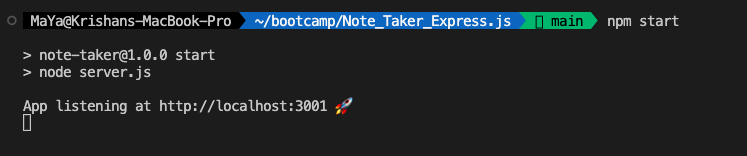
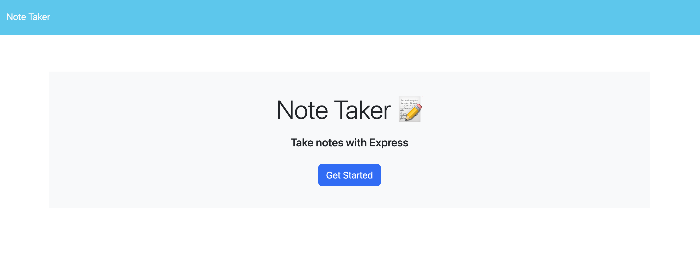
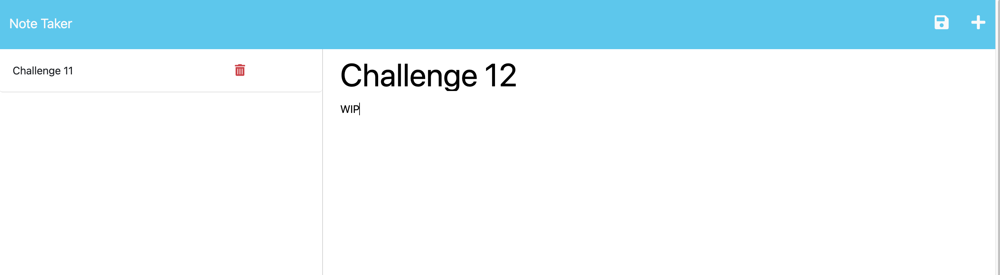

# Note Taker - Express.js

## Description

This application is designed to help small business owners in organizing their thoughts and tracking their tasks effectively. The application provides a user-friendly interface where users can write new notes, save them, and access their saved notes.
Please visit the deployed application [here](https://pacific-sands-85124.herokuapp.com/).

## Table of Contents
- [Installation](#installation)
- [Usage](#usage)
- [Credit](#credit)
- [License](#license)

## Installation
1. Clone the repository on your local
2. To install the packages, run `npm i` on your terminal

## Usage 
1. Once you install the packages, run `npm start` to start the application.
2. Visit http://localhost:3001 in your browser to access the application. Please see screenshot below

3. Click `Get Started` on the browser to visit the note taker application.

4. You can start to create, save, and select notes.

## Credit
- Assistance from tutor 

- [Bootcamp Gitlab 11-Express](https://git.bootcampcontent.com/University-of-Adelaide/UADEL-VIRT-FSF-PT-03-2023-U-LOLC/-/tree/main/11-Express/02-Challenge)

## License
Please refer to the LICENSE in the repo.
